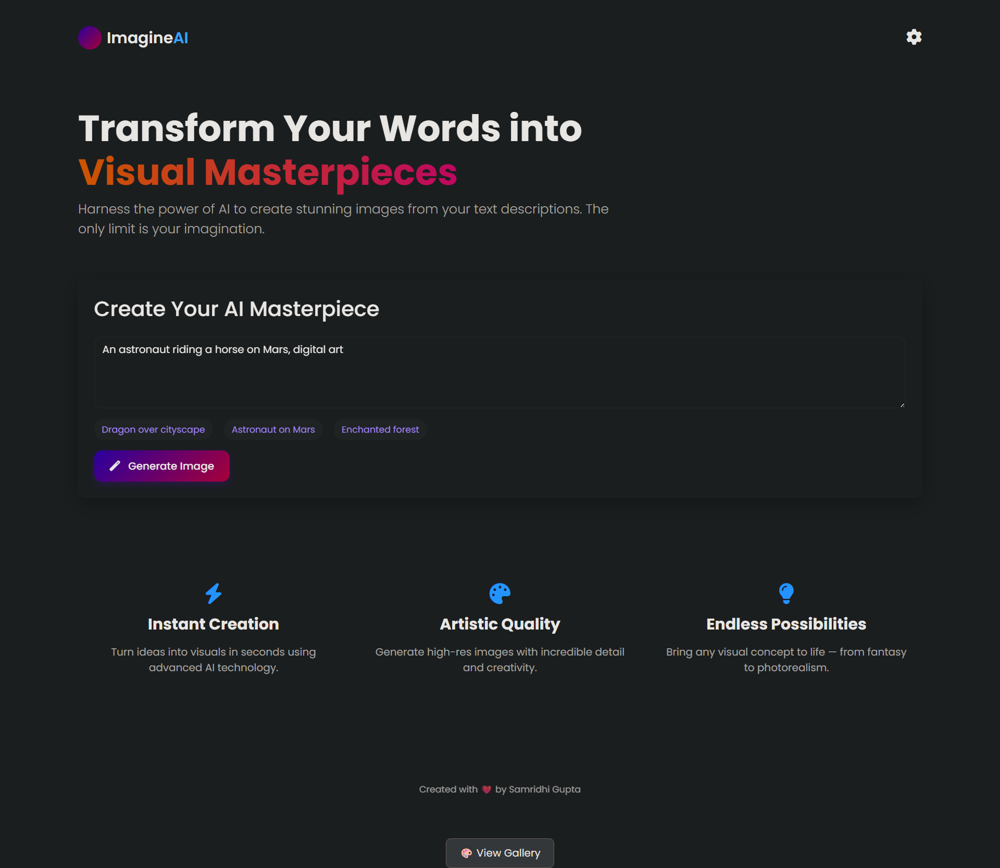
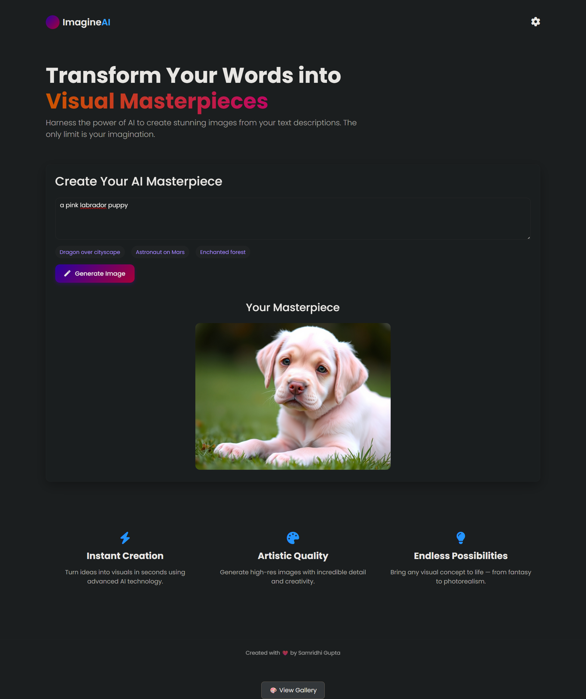
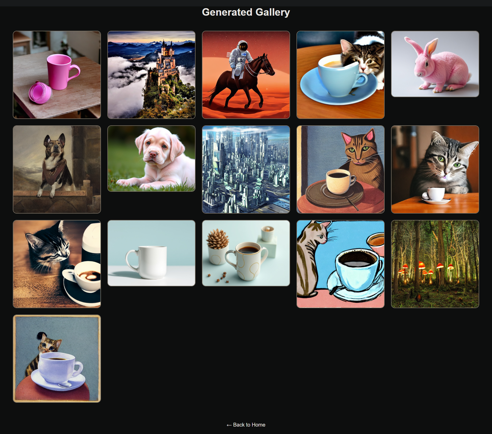

# 🎨 ImagineAI — Transform Your Words into Visual Masterpieces

> **Turn any text prompt into a stunning AI-generated image — live, free, and deployed.**

[](https://imagineai-transform-your-words-into.onrender.com)
[](https://github.com/SamridhiiiGupta/ImagineAI-Transform-Your-Words-into-Visual-Masterpieces)
[](https://python.org)
[](https://flask.palletsprojects.com)
[](https://huggingface.co/black-forest-labs/FLUX.1-schnell)

---

## 📸 Screenshots

<div align="center">

### 🏠 Landing Page

*Clean dark UI with prompt input and one-click generation*

---

### 🖼️ Generated Image

*"a pink labrador puppy" — generated in ~15 seconds via FLUX.1-schnell*

---

### 🗂️ Gallery Page

*All previously generated images displayed in a responsive grid*

</div>

---

## ✨ Features

### Core Features
- **Text-to-Image Generation** — Type any prompt and generate a high-quality AI image using Black Forest Labs' FLUX.1-schnell model
- **Image Gallery** — All generated images are saved and displayed in a persistent gallery grid
- **One-Click Download** — Download any generated image directly from the browser

### Advanced Features
- **FLUX.1-schnell Model** — State-of-the-art image generation model via fal-ai inference, routed through HuggingFace's Inference API
- **Production-grade Backend** — Gunicorn WSGI server with proper worker and timeout configuration
- **Input Validation** — Prompt length capping (500 chars), empty prompt detection, and sanitized error messages
- **Secure Token Handling** — API tokens managed via environment variables, never hardcoded

### UX Features
- **Prompt Suggestion Chips** — One-click prompt ideas to get started instantly
- **Real-time Feedback** — Loading spinner during generation, error alerts on failure
- **Responsive Design** — Works cleanly on desktop and mobile
- **Dark Theme UI** — Sleek dark interface with gradient accents

---

## 🛠️ Tech Stack

| Layer | Technology | Purpose |
|---|---|---|
| **Frontend** | HTML5, CSS3, Bootstrap 5.3 | Structure and responsive layout |
| **Styling** | Custom CSS, CSS Variables, Font Awesome 6 | Dark theme, icons, animations |
| **Fonts** | Google Fonts — Poppins | Clean, modern typography |
| **Backend** | Python 3.11, Flask 2.0+ | Web server and API routing |
| **WSGI Server** | Gunicorn | Production-grade server for deployment |
| **AI Model** | FLUX.1-schnell (Black Forest Labs) | Text-to-image generation |
| **Inference API** | HuggingFace Inference API (fal-ai provider) | Serverless GPU inference — free tier |
| **Image Processing** | Pillow | Saving generated images to disk |
| **Config** | python-dotenv | Environment variable management |
| **Deployment** | Render.com | Free-tier cloud hosting |

---

## 🏗️ Architecture Overview

```
User (Browser)
     │
     │  GET /          → renders index.html
     │  POST /generate-image  → { prompt: "..." }
     │  GET /gallery    → renders gallery.html
     ▼
Flask App (app.py)
     │
     │  Validates prompt (length, empty check)
     │  Calls HuggingFace Inference API
     │         provider: fal-ai
     │         model: black-forest-labs/FLUX.1-schnell
     ▼
fal-ai GPU (via HuggingFace router)
     │
     │  Returns PIL Image object
     ▼
Flask App
     │  Saves image → static/generated_<uuid>.png
     │  Returns { success: true, image_url: "/static/..." }
     ▼
Browser
     │  Displays image inline
     │  Download button fetches blob
```

**Data Flow:**
1. User submits a text prompt via the browser
2. JavaScript sends a `POST /generate-image` request with JSON body
3. Flask validates the prompt and calls the HuggingFace Inference API using `huggingface_hub.InferenceClient`
4. The API routes to fal-ai's GPU infrastructure, runs FLUX.1-schnell, and returns a PIL image
5. Flask saves the image to `static/` with a UUID filename
6. The image URL is returned to the frontend and displayed immediately
7. The gallery route lists all saved images from the `static/` directory

---

## 📁 Folder Structure

```
ImagineAI/
│
├── app.py                   # Flask application — routes, inference logic
├── requirements.txt         # Python dependencies (direct only)
├── Procfile                 # Gunicorn start command for Render
├── .env.example             # Environment variable template
├── .gitignore               # Excludes venv, .env, generated images
│
├── static/
│   ├── css/
│   │   └── style.css        # Global dark theme styles, CSS variables
│   ├── js/
│   │   └── script.js        # Frontend logic — fetch, loading state, download
│   └── generated_*.png      # AI-generated images (gitignored)
│
└── templates/
    ├── index.html           # Main page — prompt input, result display
    └── gallery.html         # Gallery grid of all generated images
```

---

## ⚙️ Installation & Setup

### Prerequisites
- Python 3.9 or higher
- pip
- A free [HuggingFace account](https://huggingface.co) with an API token

### 1. Clone the Repository

```bash
git clone https://github.com/SamridhiiiGupta/ImagineAI-Transform-Your-Words-into-Visual-Masterpieces.git
cd ImagineAI-Transform-Your-Words-into-Visual-Masterpieces
```

### 2. Create a Virtual Environment

```bash
python -m venv venv

# Windows
venv\Scripts\activate

# macOS / Linux
source venv/bin/activate
```

### 3. Install Dependencies

```bash
pip install -r requirements.txt
```

### 4. Set Up Environment Variables

```bash
cp .env.example .env
```

Open `.env` and fill in your token:

```env
HF_TOKEN=hf_your_token_here
FLASK_DEBUG=false
```

> Get your free HuggingFace token at: [huggingface.co/settings/tokens](https://huggingface.co/settings/tokens)
> Role: **Read** is sufficient.

### 5. Run the App

```bash
python app.py
```

The browser will open automatically at `http://127.0.0.1:5000`

---

## 🌍 Environment Variables

| Variable | Required | Description |
|---|---|---|
| `HF_TOKEN` | ✅ Yes | HuggingFace API token (`hf_...`). Used to authenticate requests to the fal-ai inference provider. Get it free at huggingface.co/settings/tokens |
| `FLASK_DEBUG` | ❌ No | Set to `true` for local development only. **Never set to `true` in production.** Defaults to `false`. |

---

## 🚀 Deployment Guide (Render — Free Tier)

### Step 1: Push to GitHub
```bash
git add .
git commit -m "production build"
git push origin main
```

### Step 2: Create a Web Service on Render
1. Go to [render.com](https://render.com) → sign up free
2. Click **New → Web Service**
3. Connect your GitHub repository
4. Set the following:
   - **Build Command:** `pip install -r requirements.txt`
   - **Start Command:** `gunicorn app:app --bind 0.0.0.0:$PORT --workers 1 --timeout 120`

### Step 3: Add Environment Variables
In your Render service → **Environment** tab:
| Key | Value |
|---|---|
| `HF_TOKEN` | Your `hf_...` token |
| `FLASK_DEBUG` | `false` |

### Step 4: Deploy
Click **Deploy**. Render will build and deploy automatically.
Your app will be live at: `https://your-service-name.onrender.com`

### ⚠️ Common Mistakes
- Don't commit your `.env` file — use Render's Environment tab
- Don't commit the `venv/` folder — it's in `.gitignore`
- Generated images are **not persisted** across Render restarts (ephemeral filesystem) — this is expected on free tier

---

## 📡 API Reference

### `POST /generate-image`
Generates an AI image from a text prompt.

**Request:**
```json
{
  "prompt": "A dragon soaring over a cyberpunk cityscape"
}
```

**Success Response (200):**
```json
{
  "success": true,
  "image_url": "/static/generated_a3f9c12b.png"
}
```

**Error Responses:**
| Status | Reason |
|---|---|
| `400` | Empty or missing prompt |
| `400` | Prompt exceeds 500 characters |
| `503` | HF_TOKEN not configured on server |
| `500` | Image generation failed (API error) |

---

### `GET /gallery`
Returns the gallery page displaying all previously generated images.

---

## ⚡ Performance & Optimizations

- **Gunicorn single worker** — Prevents memory bloat on free-tier (512MB RAM). One worker is sufficient since the bottleneck is the external API call, not CPU.
- **UUID filenames** — Prevents filename collisions across concurrent requests
- **Sorted gallery** — Images sorted by filename (reverse order) so newest appear first
- **Static file serving** — Flask serves `static/` directly; no extra file-serving middleware needed
- **Timeout 120s** — Gunicorn timeout matches expected API response time for FLUX.1-schnell

---

## 🔮 Future Improvements

- [ ] **Image style presets** — Add dropdowns for style (photorealistic, anime, oil painting, etc.)
- [ ] **Negative prompt support** — Let users exclude elements from generated images
- [ ] **Image resolution control** — Let users choose 512×512, 768×768, or 1024×1024
- [ ] **Persistent gallery storage** — Integrate cloud storage (AWS S3 / Cloudinary) so gallery survives server restarts
- [ ] **Prompt history** — Save recent prompts in localStorage for quick reuse
- [ ] **Share button** — Generate a shareable link for any image
- [ ] **Rate limiting** — Prevent API abuse with per-IP request throttling

---

## 👩‍💻 Author

**Samridhi Gupta**

[](https://github.com/SamridhiiiGupta)

---

<div align="center">

Made with ❤️ by Samridhi Gupta

⭐ If you found this project useful, consider giving it a star!

</div>
